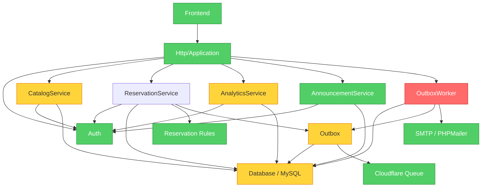

# HFI Utility Center 后端架构与业务流程审计

审计日期：2026-09-27
审计范围：`src/`、`sql/`、`tests/`、`openapi.yaml`，并核对前端 API 契约。
当前结论：需要渐进式重构。代码并非不可用，但事务与队列一致性、数据完整性、模块耦合和前后端契约仍存在上线级风险。

> 本文记录重构前的基线审计。后续实现已开始处理下列发现；当前实现与上线状态以 [DEPLOYMENT.md](DEPLOYMENT.md) 和实际代码为准。下方评分不代表重构后的重新评估结果。

## 当前健康度

按风险加权后的审计分数为 **45/100**。管理员邮箱优先预约和公开预约信息接口属于产品明确要求，因此不再作为缺陷扣分；剩余分数主要反映一致性、数据完整性和可维护性风险。

已确认的优点：

- PHP 代码全部通过语法检查。
- PHPUnit 当前通过 **53 个测试、533 条断言**。
- 使用了预处理 SQL、数据库事务、房间行锁、单次 CSRF token、哈希后的管理 token、审计日志和错误日志。
- 预约核心流程已经有较完整的数据库测试覆盖。

完整测试耗时约 **17 分 12 秒**，反馈回路明显偏慢。

## 模块关系

## 已确认的业务前提

以下行为按产品要求保留，不作为重构缺陷：

- 管理员邮箱仍然是优先预约的权限凭证。后续工作重点是让该行为有明确的前端入口、操作确认、审计记录和限流，而不是删除它。
- 预约信息接口继续公开。公开字段、搜索范围和状态展示应写进产品契约，并通过脱敏、限流和缓存保护平台稳定性。

## Critical findings

### 1. Outbox 在数据库事务中直接访问外部队列

`Outbox::enqueue()` 写入数据库后立即调用 Cloudflare Queue，而预约创建、修改和优先预约都可能在数据库事务内部发布消息。

证据：

- [`src/Worker/Outbox.php`](src/Worker/Outbox.php#L18)
- [`src/Reservation/ReservationService.php`](src/Reservation/ReservationService.php#L114)

风险：队列已经接受消息但数据库随后回滚时，会出现找不到 job 的消息；邮件发送成功但完成状态更新失败时，也可能重复发送。

建议：事务内只写 `outboxjob`。由独立 dispatcher 领取并发布，增加事件快照、幂等键和可重试状态。业务事务不应依赖外部网络请求。

### 2. 后端迁移已经和前端契约冲突

后端和数据库已经移除 `campus.isPrivileged`，但前端仍依赖该字段寻找管理员优先预约班级。当前前端的优先预约页面会因为找不到目标班级而失败。

证据：

- [`src/Catalog/CatalogService.php`](src/Catalog/CatalogService.php#L26)
- [`sql/001_schema.sql`](sql/001_schema.sql#L6)
- [`E:/Coding/UC/hfi-utility-center/lib/api/types.ts`](../hfi-utility-center/lib/api/types.ts#L8)
- [`E:/Coding/UC/hfi-utility-center/app/reservation/create/reservation-form.tsx`](../hfi-utility-center/app/reservation/create/reservation-form.tsx#L446)

建议：先确定新的优先预约契约，再同时更新前端、后端、OpenAPI 和迁移。不要单独部署删除字段的后端。

## Warning findings

### 3. `ReservationService` 已成为 God Service

预约创建、修改、审批、取消、导出、权限、策略判断、序列化和事件发布都集中在一个约 800 行的类中。

建议先拆出四个窄模块：`ReservationPolicy`、`ReservationAuthorization`、`ReservationRepository` 和 `ReservationEventPublisher`。不要先搭建一整套新框架。

### 4. 数据库无法稳定保护预约历史

`reservation.roomId`、`classId`、`latestExecutorId` 没有外键。删除房间或班级后，历史预约可能变成孤儿记录。

建议采用软删除，或补齐外键并明确 `ON DELETE` 策略；必要的房间名和班级名保存展示快照。

### 5. “没有 roomapprover 就是超级管理员”容易造成意外升级

超级管理员由授权记录数量为零推导，而且当前没有 HTTP 接口维护房间授权关系。

建议增加明确的管理员角色或全局权限字段，并提供房间授权管理接口。

### 6. AI 审核边界不足

AI secret 和预约原因被拼到 URL 查询参数中；AI 处理延迟后，批准流程没有重新检查开始时间、房间策略和冲突。

建议改为 POST JSON 加认证 header。AI 只提供建议，最终状态变更必须重新执行完整预约规则。

### 7. 测试反馈很慢，且缺少路由级测试

数据库测试每个用例都会清空整套表，完整运行约 17 分钟。现有测试主要直接调用 Service，没有覆盖 Slim 路由是否忘记挂权限校验。

此外，`cancel` 和 `modify` 实际没有消费 CSRF，但业务文档声称它们会消费，OpenAPI 也没有清楚表达这一点。

建议增加 `Application` 路由测试，测试数据库改用事务回滚或可复用 fixture，并统一 CSRF 契约。公开预约接口则应增加公开字段、分页、限流和缓存行为的契约测试。

## 更符合直觉的预约流程

| 场景 | 建议行为 |
| --- | --- |
| 普通预约 | 提交前返回明确可预约时段、冲突原因和房间规则；提交后进入 `pending`。 |
| 管理员优先预约 | 保留管理员邮箱凭证逻辑；先展示冲突，再明确选择“替换”，并要求填写原因。 |
| 公开查询 | 继续公开预约信息，但明确字段边界、分页、限流和缓存策略，避免前端和后端理解不一致。 |
| 修改与取消 | 一个管理链接统一支持预览、修改、取消，并显示剩余修改次数和重新审核状态。 |
| 房间权限 | 显式区分全局管理员与房间管理员，授权关系可在后台维护。 |
| AI 审核 | AI 只给出建议，系统重新验证业务规则后再改变预约状态。 |

## 建议实施顺序

1. 将队列发布移出业务事务，补充幂等和事件快照。
2. 修复前后端 `isPrivileged` 契约冲突。
3. 补数据库外键或软删除策略，明确管理员角色和房间授权。
4. 为管理员邮箱优先预约和公开预约接口补充明确的 OpenAPI、限流、审计和契约测试。
5. 拆分 `ReservationService`，保持现有行为不变并逐步迁移测试。
6. 最后调整用户流程、统计口径和错误提示。

所有会改变路由、请求响应、状态码或认证方式的改动，都应同步更新 `openapi.yaml` 和 PHPUnit 覆盖。
