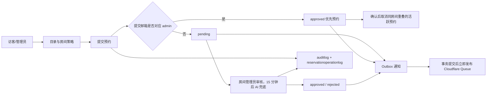

# HFI Utility Center 后端业务逻辑

本文档按当前工作区代码整理，描述 PHP 后端现在实际执行的规则。入口是 `src/Http/Application.php`，业务主要位于 `src/Auth`、`src/Catalog`、`src/Reservation`、`src/Announcement`、`src/Analytics` 和 `src/Worker`。

## 1. 系统主链路

所有写操作都经过数据库事务或单条 SQL 更新；重要业务动作写入 `auditlog`，预约状态变化额外写入 `reservationoperationlog`。异步任务先写 `outboxjob`，事务提交后立即尝试发布 Cloudflare Queue。Durable Object Alarm 每 30 秒领取到期或需要补发的任务，Queue Consumer 调用 PHP 执行接口并 `ack/retry`。

## 2. 认证、会话和写保护

### 管理员登录

- `POST /admin/login` 必须先提交一次性 CSRF token。
- 支持两种登录方式：
  - 邮箱、密码、Cloudflare Turnstile。
  - `tempadminlogin` 中 15 分钟内有效的一次性 token。
- 登录成功创建 1 小时 `adminlogin` 会话，使用 `uc` HttpOnly Cookie。
- 已登录用户不能重复登录；`GET /admin/logout` 删除会话并清理 Cookie。
- `GET /admin/check-login` 返回管理员姓名、邮箱和显式角色；无会话时返回 400。

### 权限层级

管理员权限由 `admin.role` 和 `roomapprover` 共同决定：

- `global`：可以管理所有房间；迁移时由原先无 `roomapprover` 记录的管理员映射。
- `room`：只能查看和操作 `roomapprover` 授权的房间；新管理员默认使用此角色。
- 预约列表、未来预约和导出都按同一房间范围过滤。
- 审批、管理员编辑预约时要求当前管理员拥有目标房间权限；跨房间编辑要求同时拥有原房间和目标房间权限。

全局管理员通过 `/admin/permissions` 和 `/admin/permissions/update` 维护角色及房间授权。

### CSRF

- `GET /_csrf` 创建 10 分钟有效 token。
- 每个 token 只能消费一次。
- 管理员写操作使用 `requireAdminWrite()`，即会话认证加 CSRF。
- 访客创建预约会消费 CSRF；管理 token 是取消和修改预约的凭证。公开读取接口不需要 CSRF。

## 3. 目录、房间和策略

### 公开读取

- `/campus/list`：校区。
- `/class/list`：班级及校区关联。
- `/room/list`：房间、启用状态和房间策略。
- 公开目录隐藏已归档记录及已归档校区的子项。管理员可用 `includeArchived=true` 查看并恢复；访客目录使用 `catalogcache`。

### 管理员写入

校区、班级、房间和房间策略的新增、编辑、归档、恢复、启停都需要管理员和 CSRF。校区、班级、房间的删除接口现改为软删除，历史预约仍保留关联。

房间策略包含：

- `days`：星期日到星期六，整数 0–6，不能重复。
- `startTime`、`endTime`：`[hour, minute]`，且开始时间早于结束时间。
- 预约必须在同一天内，并完整落在至少一个启用策略窗口中。

校区不再有 `isPrivileged` 字段；班级只用于目录关联，不再触发特殊预约优先级。

## 4. 预约业务

### 4.1 创建预约

入口：`POST /reservation/create`。

所有申请都先检查：邮箱格式、时间可解析、`startTime < endTime`。`preview=true` 只校验并返回预约模式及冲突，不创建预约。随后按提交邮箱是否命中 `admin.email` 分成两条规则。

前端只提交邮箱作为申请人资料；服务端用管理员记录或 `student(email, name, classId)` 映射补全姓名、班级，并在预约中保留快照。普通邮箱未注册映射时返回 422（`validation.code=student_not_registered`），不能自助录入。全局管理员可用 `/student/list`、`/student/create`、`/student/edit`、`/student/delete` 管理映射。`GET /reservation/preflight?email=...&date=YYYY-MM-DD` 返回该邮箱在所选日期交叠的全部预约及映射资料，响应禁止缓存。

#### 普通申请人

- 原因不能为空。
- 时长最多 2 小时。
- 开始时间必须晚于当前时间，且不超过未来 30 天。
- `purposeType` 只能是 `personal`、`class`、`club` 或空值。
- 房间必须存在且启用。
- 映射中的可选班级必须仍存在且未归档。
- 时间必须落在房间启用策略内。
- 同房间不能与 `pending`、`ai_reviewing` 或 `approved` 预约重叠。
- 同一邮箱在同一天的非取消预约最多 2 条。
- 创建后状态为 `pending`。

#### 管理员邮箱申请

管理员通过邮箱大小写不敏感匹配识别。管理员申请：

- 直接创建为 `approved`。
- 跳过普通申请人的原因、时长、未来 30 天、用途、房间启用、策略、冲突和每日次数限制。
- 仍要求邮箱可用、时间可解析且开始时间早于结束时间；房间必须存在。姓名取自管理员记录，班级为空，无需 `student` 映射。
- `latestExecutorId` 记录对应管理员。
- 预览返回重叠预约列表；最终请求须提交 `confirmPriority=true` 和预览中的 `expectedConflictIds`。若冲突列表已变化则返回 409，要求重新预览。
- 确认后取消同一房间内重叠的 `pending`、`ai_reviewing` 或 `approved` 预约，并为被取消预约写操作日志、发送通知。

### 4.2 查询和可见性

- `/reservation/availability` 返回某房间某天所有未被拒绝或取消的占用时段。
- `/reservation/preflight` 按邮箱和所选日期返回已有预约和预填的姓名/班级，包括拒绝或取消记录。
- `/reservation/get` 支持校区、房间、状态、用途、设备需求、时间范围、关键词、分页和按时间排序。
- `/reservation/future` 只对管理员开放，返回当前管理员可管理房间中尚未结束的预约。
- `/reservation/export` 只对管理员开放，导出其权限范围内的 XLSX；无数据返回 404。
- 访客预约列表仍可看到预约的公共字段（姓名、原因、时间、房间、状态等），但 `email` 被置空；管理员可看到邮箱。

### 4.3 申请人取消和修改

预约创建或批准时生成取消/管理 token，数据库只保存 hash，过期时间为预约开始时间。

- `GET /reservation/cancel/preview` 校验 token 并返回预约详情和剩余修改次数。
- `POST /reservation/cancel` 可以取消未开始且状态为 `pending`、`ai_reviewing` 或 `approved` 的预约；拒绝状态不能取消；token 一次性消费。
- `POST /reservation/modify` 只能修改未开始的 `pending`/`approved` 预约，最多 2 次。
- 修改后的时间仍须是未来 30 天内、最多 2 小时、在房间策略内且无冲突。
- 申请人修改会把状态重新置为 `pending`，清除执行管理员，并重新触发审核/AI 流程。

### 4.4 管理员编辑和审批

- `POST /reservation/admin-edit`：只能编辑尚未结束的 `approved` 预约；要求原房间和目标房间都有权限；目标时间必须启用、符合策略且无冲突；状态保持 `approved`。
- `POST /reservation/approval`：只能处理尚未开始的 `pending` 预约；批准或拒绝都需要房间权限；拒绝必须填写原因；批准时生成新的管理 token。
- 进入 `ai_reviewing` 后人工审批不可执行；全局管理员可通过 `/reservation/ai-unlock` 填写原因后恢复为 `pending`，并重新开始 15 分钟计时。
- 一个管理员批准后，其他有权限管理员仍能看到该预约；权限控制的是房间范围，不是“谁审批谁可见”。

## 5. AI 审核、邮件和 Outbox

预约事件写入 `outboxjob`，事务提交后立即发布 `{taskId, kind, dispatchToken}` 到 Cloudflare Queue。消费者调用受 Bearer secret 保护的 `POST /tasks/{taskId}/execute`。原 `/internal/outbox/process` 保留处理迁移前旧消息。Durable Object Alarm 每 30 秒通过 `GET /tasks` 领取发布失败或到期的任务，再写入 Queue。

当前事件类型：

- `reservation_created`
- `reservation_modified`
- `reservation_cancelled`
- `reservation_status_changed`
- `admin_reservation_notification`
- `ai_approval`

Outbox worker 使用锁 token 防止并发重复处理；处理中的任务超过 2 分钟可被重新领取。普通任务失败最多尝试 8 次；AI 任务失败后保持 `ai_reviewing` 并以最长 30 分钟的间隔继续重试，直到成功或全局管理员解锁。

AI 开启且配置 URL 时，普通创建和申请人修改会写入 15 分钟后到期的 AI 任务；在此期间人工可先处理。AI 开始后把仍为当前版本的 `pending` 预约改为 `ai_reviewing`，再作最终审批；批准时生成取消 token，并记录 `aiAdminId` 为执行者。

新普通预约只通知：开启预约通知、且能管理该房间的管理员。`global` 管理员也会收到通知。

## 6. 公告、管理员管理和统计

### 公告

- `/announcement/current` 只返回启用且内容非空的单条公告，否则返回 `null`。
- `/announcement/admin` 返回管理员编辑视图。
- `/announcement/update` 需要管理员、CSRF；标题最多 120 字符，内容最多 4000 字符，启用时内容不能为空。

### 管理员账户

管理员可以查看、创建、编辑、修改密码、开启/关闭预约通知、删除其他管理员。密码至少 6 个字符，使用 bcrypt；不能删除当前登录账户。

### 统计

- `/analytics/overview`：今日未取消预约数和当前待审核数。
- `/analytics/weekly`：过去 7 天的预约、创建、批准、拒绝、按星期和房间统计。
- 两个读取接口当前没有显式管理员校验；CSV 导出接口要求管理员。
- 部分返回字段是预留结构，目前 `reasons`、小时分布和每日创建分布返回空/零数组。

## 7. 统一响应、错误和审计

成功响应使用 `{success: true, data: ...}` 或 `{success: true, message: ...}`；失败响应使用 HTTP 状态码和 `{success: false, message: ...}`。`DEBUG=true` 时额外返回异常类型、文件、行号、trace 和上下文；关闭时只返回公开错误消息。

每个请求附带 `x-request-id`。运行错误写入 `errorlog`，业务动作写入 `auditlog`，预约状态变化写入 `reservationoperationlog`。

## 8. 已确定的产品边界与运维注意事项

1. 管理员邮箱优先预约与公开预约详情是既定产品规则；前端需清晰展示优先预约将取消的冲突预约。
2. `/analytics/overview` 和 `/analytics/weekly` 仍为公开读取；CSV 导出要求管理员。
3. Queue 采用至少一次投递。任务 ID、租约和状态更新可避免重复执行已完成任务，但 SMTP 已接受邮件而数据库尚未记为完成时，仍存在重复邮件的极小窗口。
4. 生产数据库升级前运行 `sql/003_roles_archive_preflight.sql`，修复孤儿关联，再执行迁移；迁移不会自动抹去历史关联。
5. 切换邮箱映射前先运行 `sql/004_student_email_mapping_preflight.sql`，人工处理同邮箱多姓名/班级或空姓名，再运行 `sql/004_student_email_mapping.sql`；迁移只自动导入无歧义映射并删除学号列。
5. `analytics` 表目前由导出读取，实时 overview/weekly 主要直接聚合 `reservation`。
